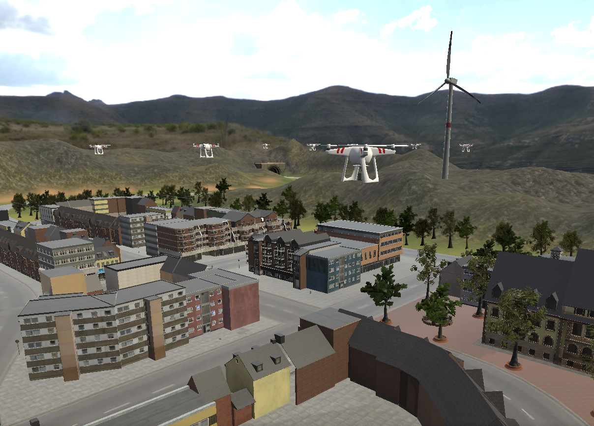
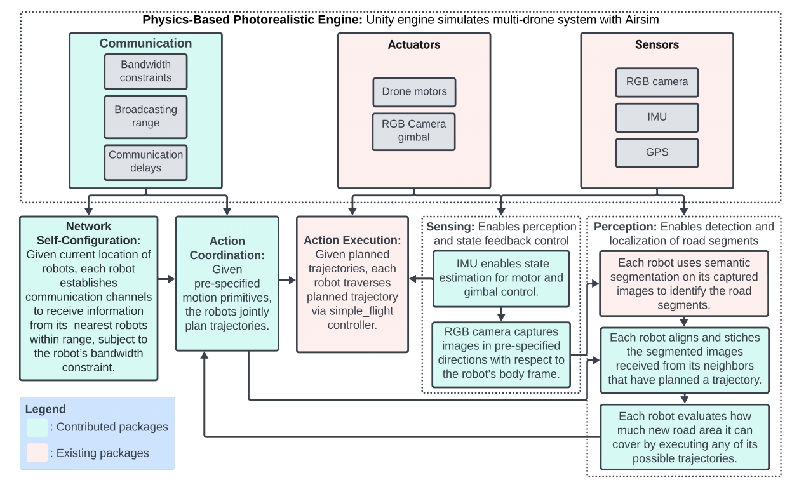

# Resource-Aware-Coordination-AirSim

We present Resource-Aware Distributed Greedy (RAG), a communication- and computation-efficient method for distributed submodular optimization in robot mesh networks. RAG introduces a new distributed optimization paradigm that enables scalable and near-optimal coordination by requiring each robot to make decisions based only on information from and about its neighbors, unlike existing methods that rely on relaying information about all robots across the network. This design ensures that RAG’s decision-time scales linearly with network size, compared to the cubic scaling of state-of-the-art algorithms. Demonstrated in simulations with up to 45 robots performing area detection tasks, RAG achieves real-time planning speeds up to three orders of magnitude faster than competitive algorithms, while delivering superior coverage performance. These simulations, conducted using realistic robot-to-robot communication speeds (e.g., 0.25 Mbps of the Digi XBee 3 Zigbee 3.0), use our extended version of the AirSim simulator, available in this git repository. Our extensions integrate a scalable collaborative autonomy pipeline for tens of robots, incorporating realistic robot-to-robot communication delays to enable high-fidelity and photorealistic testing.





---

## Setup and Installation

**Note**
The experiments described by the authors in the paper were done on Ubuntu 18.04, ROS Melodic, Unity Editor 2022.3.13f1.

To install and configure this repository, follow these steps:

1. Install Unity Editor 2022.3.13f1 using this ([link](https://unity.com/releases/editor/archive)). The instructions to install the Unity Editor are ([here](https://docs.unity3d.com/hub/manual/InstallHub.html)), starting with the Unity Hub.

2. Clone the repository:
    ```
   git clone https://github.com/UM-iRaL/Resource-Aware-Coordination-AirSim.git
   cd Resource-Aware-Coordination-AirSim/AirSim/ros
   ```

3. Install dependencies: Ensure you have all required dependencies for AirSim, ROS, and other necessary packages.
    ```
    cd Resource-Aware-Coordination-AirSim/AirSim/ros
    rosdep install --from-paths src --ignore-src -r -y
    ```

4. Build the catkin workspace from the ros workspace:
    ```
    catkin build -DCMAKE_C_COMPILER=gcc-8 -DCMAKE_CXX_COMPILER=g++-8
    ```

5. Create your photorealistic environment using the Unity Asset Store. In this paper, we used the "Urban Landscape - City" environment from this ([link](https://assetstore.unity.com/packages/3d/environments/urban-landscape-city-157460)). Then use the Unity Editor to add as many AirSim drones as intended.


## Instructions for running an experiment

The following commands must be executed via terminal and via the Unity Editor.

1. ```
    cd Resource-Aware-Coordination-AirSim/AirSim/ros
    source devel/setup.bash
    ```

2. Start roscore in a terminal.
    ```
    roscore
    ```

3. Start the Unity Editor simulation by pressing the play button in the Editor window. If you are not using the Unity Editor, you can create an x86_64 executable and run it from another terminal:
    ```
    ./unity_executable.x86_64
    ```

4. Launch the odometry ros nodes for the drones. Depending on what sensor modalities you want to visualize in rviz, choose the launch file as needed.
    ```
    roslaunch airsim_ros_pkgs airsim_node_quadrotors_imcov_odom.launch
    ```

5. Run the clock publisher node.
    ```
    rosrun image_covering_coordination clock_publisher.py
    ```

6. Launch connectivity mesh neighbors node with the number of drones you are using.
    ```
    roslaunch image_covering_coordination connectivity_mesh_neighbors.launch num_drones:=15
    ```

7. Run the coordination nodes.
    ```
    roslaunch image_covering_coordination image_covering_15drones_RAG.launch
    ```

8. Run the score logger node.
    ```
    roslaunch image_covering_coordination total_score_collective_FOV_DEBUG.launch
    ```