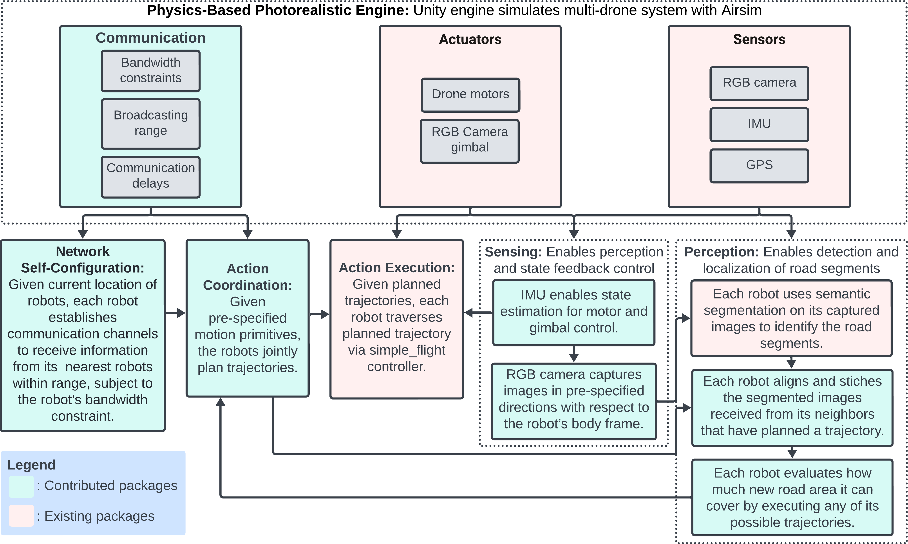

# Resource-Aware-Coordination-AirSim

We present Resource-Aware Distributed Greedy (RAG), a communication- and computation-efficient method for distributed submodular optimization in robot mesh networks. RAG introduces a new distributed optimization paradigm that enables scalable and near-optimal coordination by requiring each robot to make decisions based only on information from and about its neighbors, unlike existing methods that rely on relaying information about all robots across the network. This design ensures that RAG’s decision-time scales linearly with network size, compared to the cubic scaling of state-of-the-art algorithms. Demonstrated in simulations with up to 45 robots performing area detection tasks, RAG achieves real-time planning speeds up to three orders of magnitude faster than competitive algorithms, while delivering superior coverage performance. These simulations, conducted using realistic robot-to-robot communication speeds (e.g., 0.25 Mbps of the Digi XBee 3 Zigbee 3.0), use our extended version of the AirSim simulator, available in this git repository. Our extensions integrate a scalable collaborative autonomy pipeline for tens of robots, incorporating realistic robot-to-robot communication delays to enable high-fidelity and photorealistic testing.

